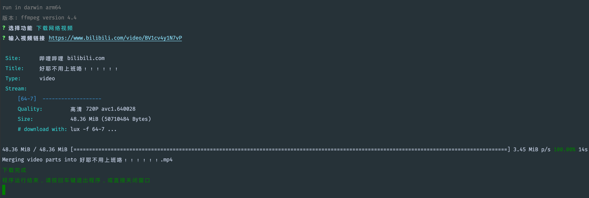
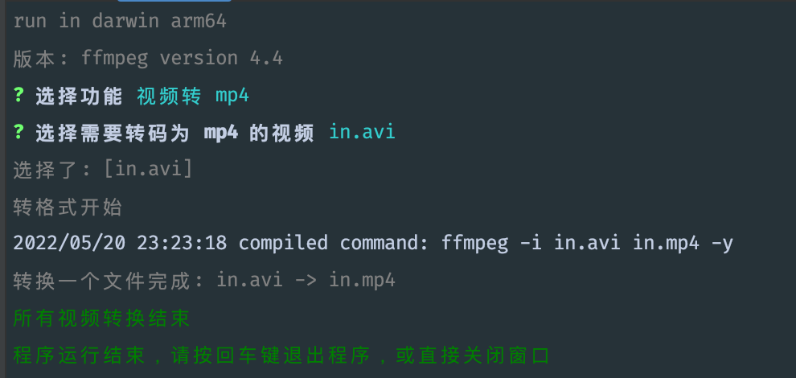

# 视频下载和转换工具

程序可编译在 Windows、Mac 平台运行。

基于 ffmpeg 实现的将当前目录下所有非 mp4 视频文件转码为 mp4 文件。

基于 lux 项目实现的网络视频下载功能。

in.avi 为测试视频，运行程序后将会生成 in.mp4 文件。生成文件不会覆盖，注意及时移走不需要转码的非 mp4 文件。

build/dependencies/ffmpeg-win 是 windows 下的 ffmpeg 可执行程序，版本为 5.0.1。

使用 fyne 制作了跨平台 GUI。

## 功能


### 下载网络视频

GUI




支持下载的站点: 

| Site       | URL                          | 🎬 Videos | 🌁 Images | 🔊 Audio | 📚 Playlist | 🍪 VIP adaptation | Build Status                                                                                                                                                                |
| ---------- | ---------------------------- | --------- | --------- | -------- | ----------- | ----------------- | --------------------------------------------------------------------------------------------------------------------------------------------------------------------------- |
| 抖音       | <https://www.douyin.com>     | ✓         | ✓         |          |             |                   | [](https://github.com/iawia002/lux/actions/workflows/stream_douyin.yml)             |
| 哔哩哔哩   | <https://www.bilibili.com>   | ✓         |           |          | ✓           | ✓                 | [](https://github.com/iawia002/lux/actions/workflows/stream_bilibili.yml)       |
| 半次元     | <https://bcy.net>            |           | ✓         |          |             |                   | [](https://github.com/iawia002/lux/actions/workflows/stream_bcy.yml)                      |
| pixivision | <https://www.pixivision.net> |           | ✓         |          |             |                   | [](https://github.com/iawia002/lux/actions/workflows/stream_pixivision.yml) |
| 优酷       | <https://www.youku.com>      | ✓         |           |          |             | ✓                 | [](https://github.com/iawia002/lux/actions/workflows/stream_youku.yml)                |
| YouTube    | <https://www.youtube.com>    | ✓         |           |          | ✓           |                   | [](https://github.com/iawia002/lux/actions/workflows/stream_youtube.yml)          |
| 西瓜视频（头条）    | <https://m.toutiao.com>, <https://v.ixigua.com>, <https://www.ixigua.com>    | ✓         |           |          |             |                   | [](https://github.com/iawia002/lux/actions/workflows/stream_ixigua.yml)   |
| 爱奇艺     | <https://www.iqiyi.com>      | ✓         |           |          |             |                   | [](https://github.com/iawia002/lux/actions/workflows/stream_iqiyi.yml)                |
| 新片场    | <https://www.xinpianchang.com>       | ✓         |           |          |             |                   | [](https://github.com/iawia002/lux/actions/workflows/stream_xinpianchang.yml)                   |
| 芒果 TV    | <https://www.mgtv.com>       | ✓         |           |          |             |                   | [](https://github.com/iawia002/lux/actions/workflows/stream_mgtv.yml)                   |
| 糖豆广场舞 | <https://www.tangdou.com>    | ✓         |           |          |             |                   | [](https://github.com/iawia002/lux/actions/workflows/stream_tangdou.yml)          |
| Tumblr     | <https://www.tumblr.com>     | ✓         | ✓         |          |             |                   | [](https://github.com/iawia002/lux/actions/workflows/stream_tumblr.yml)             |
| Vimeo      | <https://vimeo.com>          | ✓         |           |          |             |                   | [](https://github.com/iawia002/lux/actions/workflows/stream_vimeo.yml)                |
| Facebook   | <https://facebook.com>       | ✓         |           |          |             |                   | [](https://github.com/iawia002/lux/actions/workflows/stream_facebook.yml)       |
| 斗鱼视频   | <https://v.douyu.com>        | ✓         |           |          |             |                   | [](https://github.com/iawia002/lux/actions/workflows/stream_douyu.yml)                |
| 秒拍       | <https://www.miaopai.com>    | ✓         |           |          |             |                   | [](https://github.com/iawia002/lux/actions/workflows/stream_miaopai.yml)          |
| 微博       | <https://weibo.com>          | ✓         |           |          |             |                   | [](https://github.com/iawia002/lux/actions/workflows/stream_weibo.yml)                |
| Instagram  | <https://www.instagram.com>  | ✓         | ✓         |          |             |                   | [](https://github.com/iawia002/lux/actions/workflows/stream_instagram.yml)    |
| Twitter    | <https://twitter.com>        | ✓         |           |          |             |                   | [](https://github.com/iawia002/lux/actions/workflows/stream_twitter.yml)          |
| 腾讯视频   | <https://v.qq.com>           | ✓         |           |          |             |                   | [](https://github.com/iawia002/lux/actions/workflows/stream_qq.yml)                         |
| 网易云音乐 | <https://music.163.com>      | ✓         |           |          |             |                   | [](https://github.com/iawia002/lux/actions/workflows/stream_netease.yml)          |
| 音悦台     | <https://yinyuetai.com>      | ✓         |           |          |             |                   | [](https://github.com/iawia002/lux/actions/workflows/stream_yinyuetai.yml)    |
| 极客时间   | <https://time.geekbang.org>  | ✓         |           |          |             |                   | [](https://github.com/iawia002/lux/actions/workflows/stream_geekbang.yml)       |
| Pornhub    | <https://pornhub.com>        | ✓         |           |          |             |                   | [](https://github.com/iawia002/lux/actions/workflows/stream_pornhub.yml)          |
| XVIDEOS    | <https://xvideos.com>        | ✓         |           |          |             |                   | [](https://github.com/iawia002/lux/actions/workflows/stream_xvideos.yml)          |
| 聯合新聞網 | <https://udn.com>            | ✓         |           |          |             |                   | [](https://github.com/iawia002/lux/actions/workflows/stream_udn.yml)                      |
| TikTok     | <https://www.tiktok.com>     | ✓         |           |          |             |                   | [](https://github.com/iawia002/lux/actions/workflows/stream_tiktok.yml)             |
| 好看视频   | <https://haokan.baidu.com>   | ✓         |           |          |             |                   | [](https://github.com/iawia002/lux/actions/workflows/stream_haokan.yml)             |
| AcFun      | <https://www.acfun.cn>       | ✓         |           |          | ✓           |                   | [](https://github.com/iawia002/lux/actions/workflows/stream_acfun.yml)                |
| Eporner    | <https://eporner.com>        | ✓         |           |          |             |                   | [](https://github.com/iawia002/lux/actions/workflows/stream_eporner.yml)          |
| StreamTape | <https://streamtape.com>     | ✓         |           |          |             |                   | [](https://github.com/iawia002/lux/actions/workflows/stream_streamtape.yml) |
| 虎扑       | <https://hupu.com>           | ✓         |           |          |             |                   | [](https://github.com/iawia002/lux/actions/workflows/stream_hupu.yml)                   |
| 虎牙视频   | <https://v.huya.com>         | ✓         |           |          |             |                   | [](https://github.com/iawia002/lux/actions/workflows/stream_huya.yml)                   |
| 喜马拉雅   | <https://www.ximalaya.com>   |           |           | ✓        |             |                   | [](https://github.com/iawia002/lux/actions/workflows/stream_ximalaya.yml)       |
| 快手       | <https://www.kuaishou.com>   | ✓         |           |          |             |                   | [](https://github.com/iawia002/lux/actions/workflows/stream_kuaishou.yml)       |

### 视频转为 mp4 格式



## 下载

https://github.com/zhan3333/converter/releases

下载 converter.zip 文件，解压后 windows 平台双击运行 converter.exe, mac 平台双击或命令行运行 converter。

## 开发

### 运行

```shell
make run
```

### 编译

```shell
make build
```

编译完成后将生成 build/converter.exe 文件，build 目录可以独立运行程序，release 发包是打包了 build 目录。

### 发包

```shell
make release
```

执行完毕后会生成 converter.zip 文件

## 其他

开发基于 https://github.com/u2takey/ffmpeg-go

视频下载基于 https://github.com/iawia002/lux